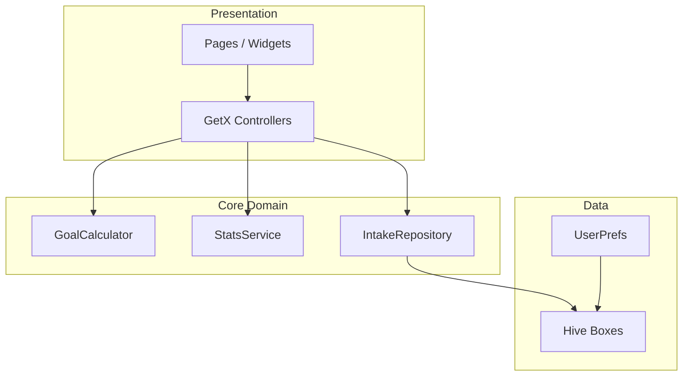

# 架构设计 — 轻补水

## 分层

## 模块划分（V1）

| 模块 | 路径 | 职责 |
|------|------|------|
| bootstrap | `lib/bootstrap/` | 初始化 Hive、启动 ModularApp |
| app | `lib/app/` | 路由、主题 |
| hydration | `lib/core/hydration/` | 模型、计算、仓储、统计 |
| onboarding | `lib/modules/onboarding/` | 引导流 |
| home | `lib/modules/home/` | 首页 |
| record | `lib/modules/record/` | 添加记录 |
| stats | `lib/modules/stats/` | 统计图表 |
| settings | `lib/modules/settings/` | 设置 |

## V2 扩展点

- `lib/modules/achievements/` — 勋章
- `lib/modules/reminders/` — 复用模板 NotificationService
- `lib/modules/ai_chat/` — DeepSeek client
- `lib/core/sync/` — Supabase sync adapter

## 数据流：快捷加水

1. `HomeController.addQuickIntake(250)` 
2. `IntakeRepository.add(IntakeRecord)` → Hive append
3. `StatsService.todayTotal()` 重算
4. `Obx` 刷新水瓶与列表
