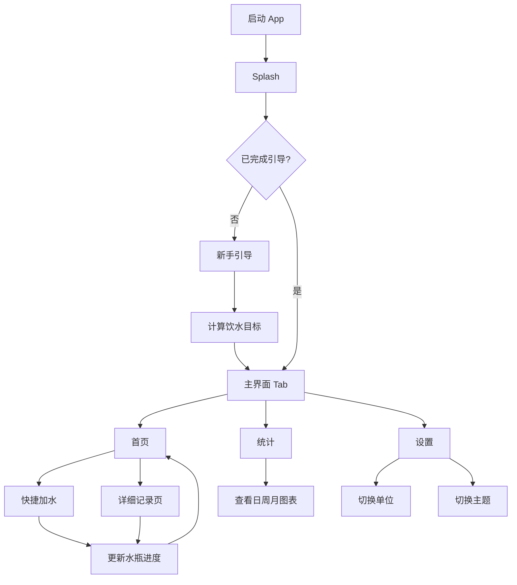
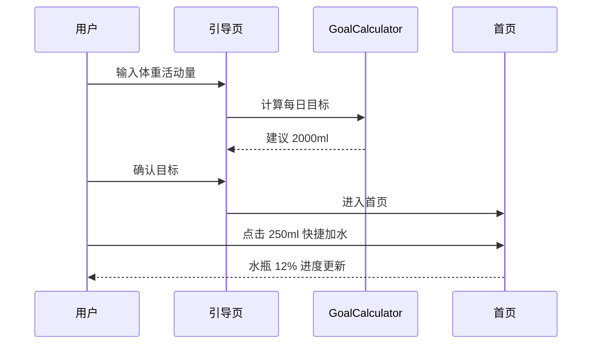
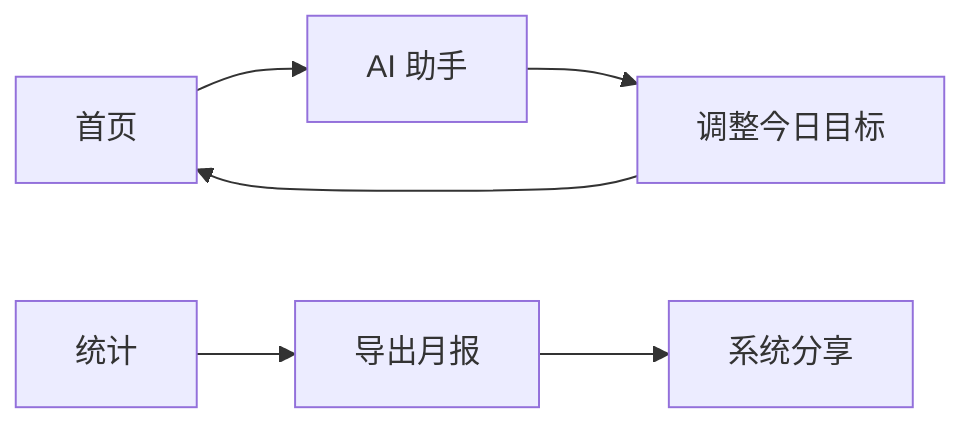

# 用户流程图 — 轻补水

## 主流程

```mermaid
flowchart TD
  launch[启动 App] --> splash[Splash]
  splash --> checkOnboard{已完成引导?}
  checkOnboard -->|否| onboard[新手引导]
  checkOnboard -->|是| main[主界面 Tab]
  onboard --> calcGoal[计算饮水目标]
  calcGoal --> main
  main --> home[首页]
  main --> stats[统计]
  main --> settings[设置]
  home --> quickAdd[快捷加水]
  home --> detailAdd[详细记录页]
  quickAdd --> updateProgress[更新水瓶进度]
  detailAdd --> updateProgress
  updateProgress --> home
  stats --> viewChart[查看日周月图表]
  settings --> unit[切换单位]
  settings --> theme[切换主题]
```

## 首次用户流程

```mermaid
sequenceDiagram
  participant U as 用户
  participant O as 引导页
  participant G as GoalCalculator
  participant H as 首页

  U->>O: 输入体重活动量
  O->>G: 计算每日目标
  G-->>O: 建议 2000ml
  U->>O: 确认目标
  O->>H: 进入首页
  U->>H: 点击 250ml 快捷加水
  H-->>U: 水瓶 12% 进度更新
```

## V2 扩展流程（文档预留）

```mermaid
flowchart LR
  home[首页] --> ai[AI 助手]
  ai --> adjust[调整今日目标]
  adjust --> home
  stats[统计] --> export[导出月报]
  export --> share[系统分享]
```
